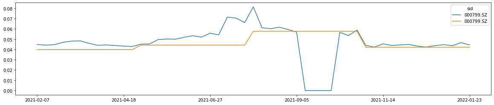
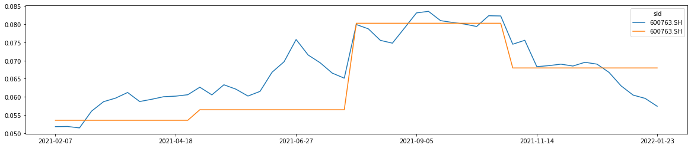
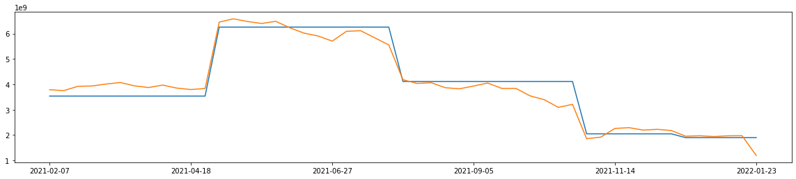
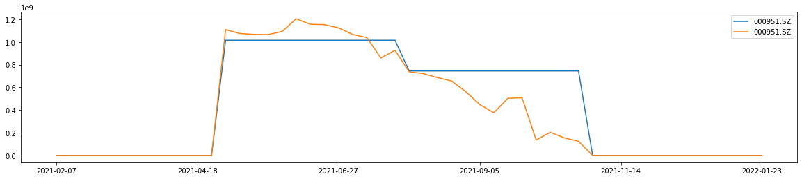
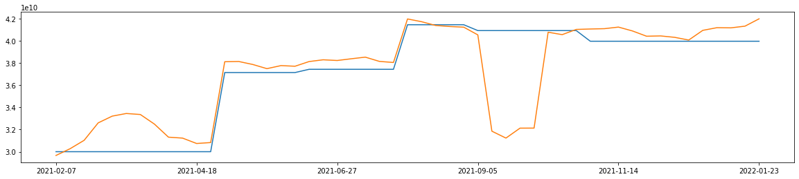
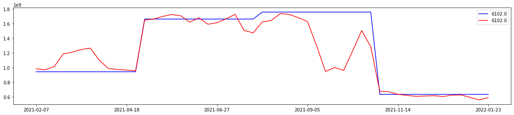
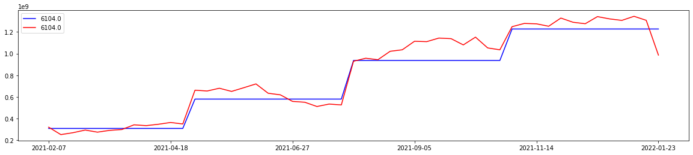
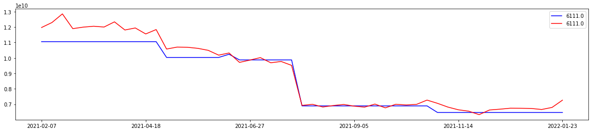
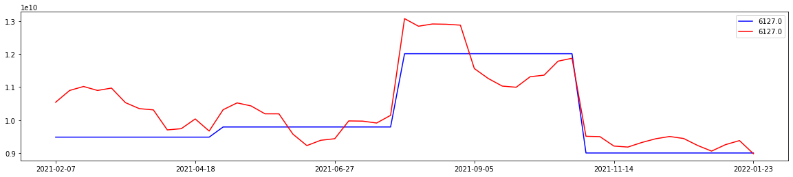
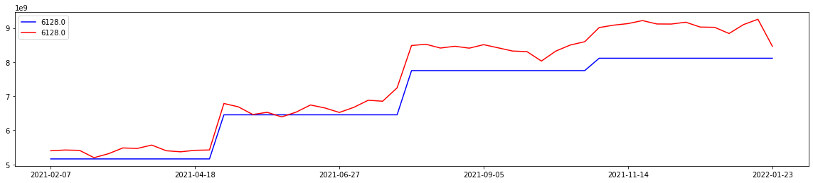

### 百亿公募基金研究

#### 1. 基金披露信息整理

基金的持仓信息、基金份额等均只在季度或者半年度频率披露，大致的披露日期如下：
$$
\begin{array}{|l|l|l|l|l|l|l|}
\hline  { 披露日期 } &  { 1-31 } &  { 3-31 } &  { 4-30 } &  { 7-31 } &  { 8-31 } &  { 10-31 } \\
\hline  { 包含信息 } &  { 上一年 度 } &  { 上一年度 } &  { 本 年 度 }- &  { 本 年度 } &  { 本年度 半 } &  { 本年度三季 } \\
&  { 四季报 } &  { 年报 } &  { 季报 } &  { 季报 } &  { 年报 } &  { 报 } \\
\hline  { 披露信息 } &  { 前十重仓 } &  { 全部持仓 } &  { 前十重仓 } &  { 前十重仓 } &  { 全部持仓 } &  { 前十重仓 } \\
\hline
\end{array}
$$
基金披露信息时，离基金经理的实时持仓相距半个月~1个月。

基金的净值每日披露。

#### 2. 算法介绍
记$y_t$代表t日基金涨跌幅，$R_t$代表股票收益率矩阵，$reptop_{i,t}$ (i=1,…,10)代表截止至t日最新披露的十大重仓，$repall_{i,t}$ (i=1,…,m)代表截止至t日最新披露的全部持仓。以下是我们在t日进行的带惩罚项的回归模型：

$min⁡_w⁡[||y-Rw||_2^2 +λ||w-w_{reptop} ||_2^2+λ*ratio||w-w_{repall} ||^2]$（2）

约束条件：w的分量在[0, 1]之间，w的分量和小于等于1

其中$w_{reptop}$为十大重仓权重在股票池中的扩展(股票池中未在十大重仓中的赋为0)，$w_{repall}$为最新一次全部持仓的权重(股票池中未在最新全部持仓的赋为0)。此时w的长度为股票池中股票的数目。

#### 3. 结果
3.1 大基金效果

我们选取基金规模前3的基金进行对比，这里以季末对比为例。

招商中证白酒(161725.OF, 776亿)

$$
\begin{array}{|l|l|l|l|l|l|l|l|l|}
\hline & S1 月底  & &  { S2 月底 } & &  { S3 月底 } & &  { S4 月底 } & \\
\hline  { sid } &  { pred-S4 } &  { S1-S4 } &  { pred-S1 } &  { S2-S1 } &  { pred-S2 } &  { S3-S2 } &  { diff } &  { S4-S3 } \\
\hline  { 600809.SH } & \mathbf{0 . 0 0 4 3} & \mathbf{0 . 0 0 2 5} & 0.0056 & -0.0083 & 0.0008 & 0.0237 & -0.0021 & -0.0172 \\
\hline  { 600519.SH } & \mathbf{0 . 0 0 2 1} & \mathbf{0 . 0 2 0 3} & 0.0004 & -0.0086 & 0.0032 & 0.0063 & 0.0027 & 0.0063 \\
\hline 000568 . S Z & \mathbf{0 . 0 0 4 0} & \mathbf{0 . 0 2 0 7} & -0.0020 & -0.0296 & \mathbf{0 . 0 0 2 8} & \mathbf{0 . 0 1 8 7} & -0.0013 & 0.0057 \\
\hline 000858 . S Z & \mathbf{0 . 0 0 4 9} & \mathbf{0 . 0 0 7 3} & 0.0000 & 0.0145 & 0.0040 & -0.0165 & \mathbf{0 . 0 0 4 0} & \mathbf{0 . 0 0 8 7} \\
\hline 002304 . S Z & -0.0012 & -0.0263 & 0.0016 & 0.0131 & 0.0007 & -0.0071 & -0.0016 & -0.0134 \\
\hline 000799 . S Z & \mathbf{0 . 0 0 4 6} & \mathbf{0 . 0 0 4 4} & \mathbf{0 . 0 1 0 0} & \mathbf{0 . 0 1 3 4} & -0.0010 & -0.0156 & 0.0026 & 0.0009 \\
\hline 000596 . S Z & 0.0006 & -0.0036 & 0.0010 & -0.0029 & \mathbf{0 . 0 0 3 3} & \mathbf{0 . 0 1 4 0} & 0.0020 & -0.0069 \\
\hline 600779 . S H & 0.0000 & 0.0000 & \mathbf{0 . 0 0 9 3} & \mathbf{0 . 0 2 5 2} & \mathbf{0 . 0 0 4 1} & \mathbf{0 . 0 0 7 5} & 0.0017 & -0.0041 \\
\hline 603369 . S H & 0.0009 & -0.0007 & -0.0008 & -0.0047 & 0.0016 & -0.0048 & \mathbf{0 . 0 0 3 4} & \mathbf{0 . 0 0 8 1} \\
\hline 603198 . S H & 0.0000 & 0.0000 & 0.0046 & 0.0000 & \mathbf{0 . 0 0 4 8} & \mathbf{0 . 0 1 8 0} & 0.0005 & \\
\hline 603589 . S H & 0.0007 & 0.0009 & -0.0003 & -0.0037 & 0.0002 & -0.0248 & \mathbf{0 . 0 0 9 8} & \mathbf{0 . 0 2 6 8} \\
\hline 603919 . S H & 0.0000 & 0.0000 & 0.0069 & & & & & \\
\hline 600559 . S H & 0.0000 & 0.0000 & 0.0076 & & & & & \\
\hline 000860 . S Z & -0.0042 & -0.0106 & 0.0020 & -0.0312 & 0.0004 & 0.0000 & 0.0041 & \\
\hline 300911 . S Z & 0.0000 & 0.0000 & 0.0000 & & & & & \\
\hline
\end{array}
$$

浅蓝色度数据为真实季度换仓变化，S1月底数据为预测季度变化。对000799.SZ的预测较好
 

中欧医疗健康（003095.OF,775亿）
$$
\begin{array}{|l|l|l|l|l|l|l|l|l|}
\hline &  { S1 末 } & &  { S2 末 } & &  { S3 末 } & &  { S4 末 } & \\
\hline  { sid } &  { pred-S4 } &  { S1-S4 } &  { pred-S1 } &  { s2-s1 } &  { pred-S2 } &  { S3-S2 } &  { pred-S3 } &  { S4-S3 } \\
\hline  { 603259.SH } & \mathbf{0 . 0 0 8 4} & \mathbf{0 . 0 1 2 2} & -0.0143 & 0.0065 & 0.0053 & -0.0003 & -0.0002 & 0.0213 \\
\hline  { 300015.SZ } & 0.0050 & -0.0065 & -0.0300 & 0.0182 & -0.0020 & -0.0116 & 0.0023 & -0.0003 \\
\hline  { 300759.SZ } & \mathbf{0 . 0 1 1 6} & \mathbf{0 . 0 5 3 2} & \mathbf{0 . 0 1 9 7} & \mathbf{0 . 0 1 1 1} & 0.0085 & 0.0172 & 0.0013 & -0.0112 \\
\hline 002821 . S Z & 0.0053 & -0.0025 & 0.0085 & 0.0021 & 0.0063 & 0.0181 & -0.0010 & -0.0034 \\
\hline  { 300347.SZ } & 0.0048 & -0.0086 & 0.0102 & 0.0019 & 0.0069 & 0.0201 & -0.0010 & -0.0104 \\
\hline  { 600763.SH } & 0.0058 & 0.0029 & \mathbf{0 . 0 1 5 1} & \mathbf{0 . 0 2 3 8} & -0.0009 & -0.0123 & -0.0049 & -0.0199 \\
\hline  { 300122.SZ } & 0.0044 & 0.0124 & 0.0014 & -0.0103 & 0.0012 & -0.0128 & 0.0062 & \\
\hline  { 300760.SZ } & 0.0059 & 0.0004 & 0.0156 & 0.0027 & -0.0009 & -0.0205 & 0.0014 & \\
\hline  { 300363.SZ } & & & & & 0.0064 & -0.0044 & -0.0048 & -0.0034 \\
\hline  { 688202.SH } & & & & & & & -0.0100 & \\
\hline
\end{array}
$$
中欧医疗基金中，很好地预测到大的加减仓。以600763.SH为例：
  
前两个季度很好的预测到了加仓。

易方达蓝筹（005669.OF,676亿）
$$
\begin{array}{|l|l|l|l|l|l|l|l|}
\hline &  { S1-S4 } &  { S1pred - } &  { S2-S1 } &  { S2pred - } &  { S3-S2 } &  { S3pred - } &  { S4pred - } \\
& &  { S4 } & &  { S1 } & &  { S2 } &  { S3 } \\
\hline  { sid } & & & & & & & \\
\hline 000568 . S Z & -0.0163 & -0.0071 & 0.0209 & 0.0061 & 0.0022 & 0.0037 & 0.0008 \\
\hline 000858 . S Z & 0.0062 & 0.0012 & -0.0017 & 0.0029 & -0.0004 & 0.0086 & 0.0021 \\
\hline 002304 . S Z & -0.0480 & -0.0011 & 0.0500 & 0.0128 & -0.0020 & 0.0071 & -0.0021 \\
\hline 002415 . S Z & 0.0070 & 0.0030 & 0.0074 & 0.0027 & 0.0331 & 0.0116 & -0.0025 \\
\hline 0388 . \mathrm{HK} & 0.0064 & 0.0024 & -0.0014 & -0.0014 & -0.0041 & -0.0009 & 0.0016 \\
\hline 0700 . \mathrm{HK} & -0.0005 & -0.0034 & 0.0035 & 0.0001 & -0.0041 & -0.0071 & 0.0031 \\
\hline 3690 . \mathrm{HK} & 0.0006 & -0.0030 & -0.0135 & -0.0031 & & -0.0101 & \\
\hline 3968 . \mathrm{HK} & & & 0.0022 & 0.0033 & -0.0190 & 0.0042 & 0.0006 \\
\hline 600036 . S H & & & 0.0025 & 0.0018 & 0.0149 & 0.0119 & 0.0010 \\
\hline 600519 . S H & 0.0022 & 0.0002 & -0.0011 & 0.0049 & 0.0016 & 0.0053 & 0.0018 \\
\hline
\end{array}
$$
可以观察预测权重变化和实际权重变化的相关性系数如下：
$$
\begin{array}{|l|l|l|l|l|l|l|}
\hline &  { S1-S4 } &  { S1pred - S4 } &  { S2-S1 } &  { S2pred - S1 } &  { S3-S2 } &  { S3pred - S2 } \\
\hline  { S1-S4 } & 1.0000 & 0.3828 & & & & \\
\hline  { S1pred - S4 } & 0.3828 & 1.0000 & & & & \\
\hline  { S2-S1 } & & & 1.0000 & 0.9034 & & \\
\hline  { S2pred - S1 } & & & 0.9034 & 1.0000 & & \\
\hline  { S3-S2 } & & & & & 1.0000 & 0.5782 \\
\hline  { S3pred - S2 } & & & & & 0.5782 & 1.0000 \\
\hline
\end{array}
$$

3.2 百亿公募持有总量汇总

我们选取了截止至报告期20210930的基金规模超过100亿的混合型基金和股票型基金，总计93只。其中出现在十大重仓的基金个数排名前十的如下：

$$
\begin{array}{|l|l|l|l|l|l|}
\hline  { 600519. SH } &  { 贵州茅台 } & 38 & 603259 . \mathrm{SH} &  { 药明康德 } & 27 \\
\hline 300750 . \mathrm{SZ} &  { 宁德时代 } & 34 & 000333 . \mathrm{SZ} &  { 美的集团 } & 24 \\
\hline 601012 . \mathrm{SH} &  { 隆基股份 } & 34 & 601318 . \mathrm{SH} &  { 中国平安 } & 21 \\
\hline 000858 . \mathrm{SZ} &  { 五粮液 } & 34 & 600809 . \mathrm{SH} &  { 山西汾酒 } & 20 \\
\hline 002415 . \mathrm{SZ} &  { 海康威视 } & 28 & 300760 . \mathrm{SZ} &  { 迈瑞医疗 } & 19 \\
\hline
\end{array}
$$

这里我们绘制两条曲线，一条是按照最新披露权重加权计算的百亿公募持仓量汇总，一条是按照我们算法估计的权重加权计算的百亿公募持仓量汇总。

在所有股票（共480只）中，有些股票能体现出算法的优势，比如长春高新、中国重汽等
 
 
他们会在权重披露之前（蓝线拐点处）出现相应的趋势。
但是有一部分出现下图情况
  
这一类表现为随着披露而发生重大变化，但是在披露之前未看出较大趋势，可能造成的原因有：1）股票在多只基金存在，算法带来的误差累加。2）基金规模存在滞后。

3.3  百亿公募持有量行业汇总

类似3.2将股票映射到相应的行业中得到，下图中：

蓝线代表使用最新的百亿公募基金披露数据行业汇总，红线代表使用算法估计的最新行业汇总

$$
\begin{array}{|l|l|l|l|l|l|l|l|}
\hline 6101 &  { 农林牧渔 } & 6110 &  { 信息设备 } & 6119 &  { 金融服务 } & 6127 &  { 机械设备 } \\
\hline 6102 &  { 桑掘 } & 6111 &  { 家用电器 } & 6120 &  { 商业贸易 } & 6128 &  { 国防军工 } \\
\hline 6103 &  { 化工 } & 6112 &  { 食品饮料 } & 6121 &  { 休闲服务 } & 6129 &  { 汽车 } \\
\hline 6104 &  { 钢铁 } & 6113 &  { 纺织服装 } & 6122 &  { 信息服务 } & 6130 &  { 计算机 } \\
\hline 6105 &  { 有色金属 } & 6114 &  { 轻工制造 } & 6123 &  { 综合 } & 6131 &  { 传媒 } \\
\hline 6106 &  { 建筑建材 } & 6115 &  { 医药生物 } & 6124 &  { 建筑材料 } & 6132 &  { 通信 } \\
\hline 6107 &  { 机械设备 } & 6116 &  { 公用事业 } & 6125 &  { 建筑装饰 } & 6133 &  { 银行 } \\
\hline 6108 &  { 电子 } & 6117 &  { 交通运输 } & 6126 &  { 电气设备 } & 6134 &  { 非银金融 } \\
\hline 6109 &  { 交运设备 } & 6118 &  { 房地产 } & & & & \\
\hline
\end{array}
$$			
以采掘、钢铁、家用电器、机械设备、国防军工为例：
 
 
 
 
 
 3.4 变动效应

由3.2和3.3其实可以看出，很多估计的权重基本都会随着新一期的披露发生较大变化。原因可能是基金规模的变化，其次是采样导致的估计误差，因而我们可以以权重变动作为截面指标。

类似3.1我们可以使用每一季季末的估计值减去上一季度的重仓值 与 将要披露的这一季季末重仓值减去上一季度的重仓值 的 相关性来检验算法效率。对于存在多只基金的股票而言，我们需要按照基金规模加权变化值。
$$
\begin{array}{|l|l|l|l|}
\hline  { 时间 } &  { 第一季度末 } &  { 第二季度末 } &  { 第三季度末 } \\
\hline  { 相关性 } & 0.237 & 0.268 & 0.224 \\
\hline  { 股票截面个数 } & 258 & 309 & 290 \\
\hline
\end{array}
$$
