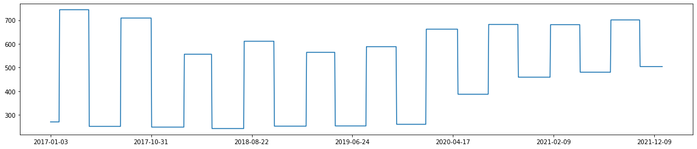
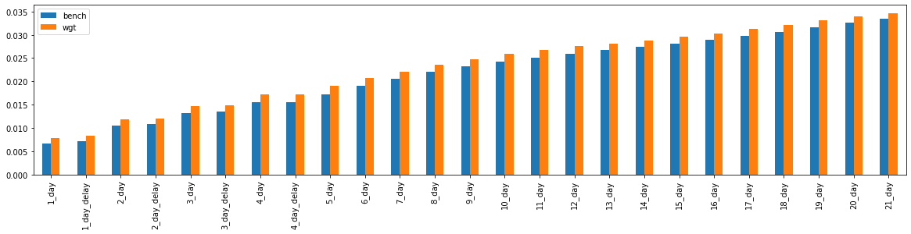
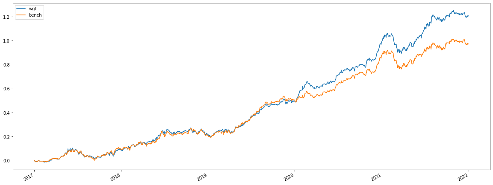

## **重仓基金效果**

基金池筛选：

 - 最新披露基金股票投资市值超过100亿元
 - 最新披露前十重仓股票市值合计占股票投资市值比大于0.5

股票池筛选：

    上述基金池中基金涉及的A股或港股。
最终选得基金个数为63只，股票池为基金的重仓股票。

### **一、 数据获取**

这里我们获得63只基金的每日净值数据（最早追溯到2017-01-01）以及每季度披露前十重仓、半年度披露的全部持仓，得到如下矩阵：

- 基金收益率矩阵Frtn（dateset * fund_universe）
- 最新披露前十重仓矩阵Top（dateset * fund_universe * stock_universe）
- 最新披露全部持仓矩阵All（dateset * fund_universe * stock_universe）
-	股票收益率矩阵Srtn（dateset * stock_universe）
-	基金规模矩阵Size（dateset * fund_universe * stock_universe）

### **二、 模型简介**

记Frtn_t代表t日基金涨跌幅，Srtn_t代表股票收益率矩阵，Top_t代表截止至t日最新披露的十大重仓，All_t代表截止至t日最新披露的全部持仓。以下是我们在t日进行的带惩罚项的回归模型：

$min⁡_w⁡[||y-Rw||_2^2 +λ||w-w_{reptop} ||_2^2+λ*ratio||w-w_{repall} ||^2]$

约束条件：w的分量在[0, 1]之间，w的分量和小于等于1

此时w的长度为股票池中全部持仓矩阵权重非零或者十大重仓矩阵权重非零的股票的数目。

### **三、 结果展示**

通过对每一只基金daily进行上述模型的计算得到w，再按照各个基金的规模进行加权平均得到预估权重矩阵Wgt(dateset * fund_universe * stock_universe),这里我们选取benchmark为Top矩阵，以与后几日收益率的相关性为判断指标。

- 每一时间段的有效股票数量如下：

股票池数量维持在300~700只之间。

- 截面对比如下：
参数取值：λ=0.03，ratio = 0
 
从上图中可以发现预估权重矩阵的效果在预测未来各个时间段都比bench更强一些。我们以他们的差进行排序：

$$
\begin{array}{llll}
\hline & \text { bench } & \text { wgt } & \text { diff } \\
\hline \text { 5day } & 0.017278 & 0.019123 & 0.001845 \\
\hline \text { 6day } & 0.019008 & 0.020758 & 0.001750 \\
\hline \text { 4day } & 0.015479 & 0.017143 & 0.001664 \\
\hline \text { 11day } & 0.025119 & 0.026758 & 0.001639 \\
\hline \text { 10day } & 0.024209 & 0.025833 & 0.001624 \\
\hline \text { 12day } & 0.025958 & 0.027574 & 0.001616 \\
\hline
\end{array}
$$
1周到2周为wgt强于bench的最佳预测周期。

### **三、Alpha表现**

  - Bench：仅按照最新披露的十大重仓权重按照基金规模加权得到的值
  - Wgt：在Bench的基础上使用以下L2-penal模型进行每日修正

记$Frtn_t$代表t日基金涨跌幅，$Srtn_t$代表股票收益率矩阵，$Top_t$代表截止至t日最新披露的十大重仓，$All_t$代表截止至t日最新披露的全部持仓。以下是我们在t日进行的带惩罚项的回归模型：
$$
min_w⁡[||Frtn_t-Srtn_t  w||_2^2 +λ||w-Top_t ||_2^2+λ*ratio||w-All_t ||_2^2]
$$
约束条件：w的分量在[0, 1]之间，w的分量和小于等于1

此时w的长度为股票池中全部持仓矩阵权重非零或者十大重仓矩阵权重非零的股票的数目。

模型参数选取λ=0.03，ratio = 0

Bsim回测：选取前50只，benchmark: zz500，limit: True

Pnl曲线图如下：
  
- Wgt具体收益：

| DATES | RET(\%) | TVR(\%) |MDD(\%) | CALMAR | SHARPE|WIN(\%)
|-|-|-|-|-|-|-|
|20170103-20171229| 9.3864 | 3.8931|8.7487 | 1.0729 | 1.1463 | 52.4590 |
|20180102-20181228 |13.1242| 4.2412 | 5.6846 | 2.3087 | 1.4267 |52.6749|
|20190102-20191231|26.9621 | 4.4078 | 7.7790 | 3.4660 | 3.1003 |58.1967|
|20200102-20201231|49.3623|4.6023| 5.8956 |8.3727 | 4.6724 |60.0823|

$$
\begin{array}{l|llllll}
\text { DATES } & \text { RET(\%) } & \text { TVR(\%) } & \text { MDD(\%) } & \text { CALMAR } & \text { SHARPE } & \text { WIN(\%) } \\

\text { 20210104-20211231 } & \mathbf{2 1 . 8 5 8 7} & 4.3168 & 16.7076 & 1.3083 & 1.3472 & \mathbf{5 5 . 9 6 7 1}
\end{array}
$$
Bench具体收益：
$$
\begin{array}{l|llllll}
\text { DATES } & \text { RET(\%) } & \text { TVR(\%) } & \text { MDD(\%) } & \text { CALMAR } & \text { SHARPE } & \text { WIN(\%) } \\
\hline \text { 20170103-20171229 } & 10.1269 & 1.1309 & 9.3698 & 1.0808 & 1.3141 & 53.2787 \\
\text { 20180102-20181228 } & 11.5016 & 1.0019 & 6.3418 & 1.8136 & 1.2095 & 50.6173 \\
\text { 20190102-20191231 } & 28.8501 & 1.0455 & 7.8273 & 3.6858 & 3.3047 & 56.1475 \\
\text { 20200102-20201231 } & 37.2015 & 1.1254 & 5.2101 & 7.1403 & 3.9901 & 58.8477 \\
\text { 20210104-20211231 } & 9.5441 & 0.8902 & 15.6996 & 0.6079 & 0.6393 & 53.4979
\end{array}
$$
 

