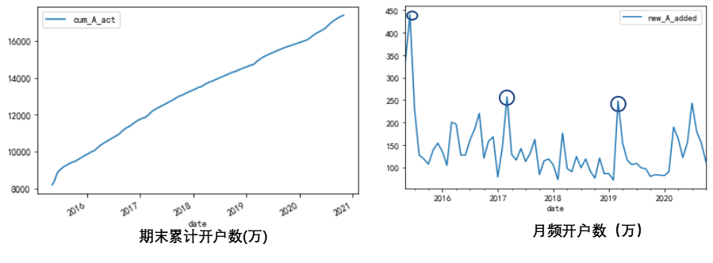
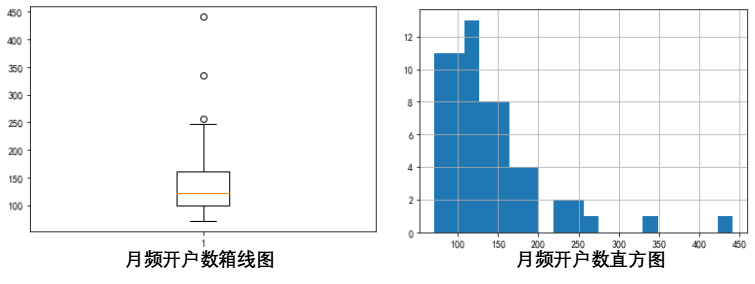
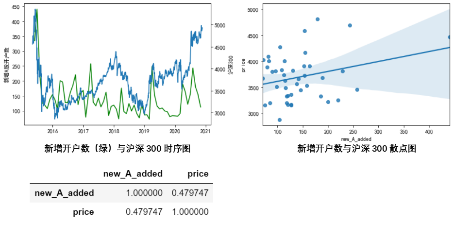
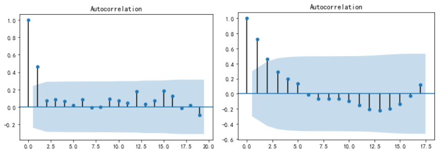

### 基于A股开户数的研究

A股新开股票账户数直接体现了某段时间内进入A股市场的投资者的数量，可以看作是投资者根据金融市场的状况所做出的行为决策，反映了投资者最朴素的财富需求，是股票市场冷暖的“温度计”。因此，往往被研究者当作研究投资者情绪的重要指标。

我们以2015年5月至2020年10月的每月新增A股开户数为研究数据进行描述性分析和与沪深300进行关联分析。

上左图中，我们发现期末累计开户数不断上升，在上右图中，周频开户数的波动一定程度上反映了各个时期投资者对待金融市场的情绪有所不同。

一、统计分析

这里我们主要针对月频开户数进行统计分析。

1.1 异常值分析

先看下描述性统计

	new_A_added
    count	66
    mean	139.54
    std	    63.64
    min	    71.24
    25%	    98.64
    50%	    120.99
    75%	    160.32
    max	    440.78

从上述图表中我们可以看到数据主要集中在100附近，并且异常值出现在高位，通过箱线图我们知道有三个极为异常的日期，分别为

    2015年5月31日 、2015年6月30日 2014 年下半年A股摆脱了
    连续几年的低迷格局，新增投资者数量急剧增张，12 月上证指数以
    3232 点收官，上涨幅度较高。2015 年由于金融监管松懈，银行资
    本及民间资本大量入市。
以及

    2017年3月31日 2017第一季度上市公司比上年末增加133家，上市
    总股本比上年同期增长14.1%
可以看出，投资者对于市场的反应还是比较明显，特别是出现较大新增开户数的时点。同时可以关注的是，进入2020年以来，由于疫情的原因A股的开户数增长的时间较往年更长，16至19年新开户数增长的时间大致维持一个季度便大幅下降，而2020年的增势维持到了第二个季度。

1.2 关联分析

一方面，股票指数的高低对新增开户数具有一定的影响；另一方面，新增开户数也体现
了投资者的情绪和经验，新增开户数猛增，说明投资者对股票市场持乐观态度，但同时也涌入了大量缺乏经验的投资者，致使股票市场不稳定性加剧。因此，研究股票指数和新增开户数之间的关系十分重要。

15年的时候，开户数和沪深300的价格同时暴跌，17年的高点和19年的高点均发生在指数上升的趋势当中，而18年由于年初开始的下跌导致当年A股新开户数上升的空间不大，不及其余几年。右边的回归散点图在一定程度上体现了，当指数处于较高水平时，涌入A股市场的投资者会增多。而从相关系数矩阵中，我们也可以看出，相关性接近0.48。
	
1.3 因果分析

相关性分析往往只能说明研究对象之间的相关程度，并不能说明内在的因果关系，可能是前者影响后者，也可能是后者影响前者，这两种情形在金融市场的体现往往会带来不一样的对应策略，因此因果分析的研究是必要的。做因果分析时，我们常用的方法是格兰杰因果分析。在进行格兰杰因果分析之前，我们需要对我们研究的序列做稳定性分析。

1.3.1 ADF 平稳性检验

	
    Result：
	               ADF值	p-值	结果
    Index	      -2.05	   0.2633	不稳定
    Index_diff	  -4.24	   0.0006	稳定
    月新增用户数   -5.31	   5.27e-06 稳定
则由上述分析，我们知道月新增开户数在2015年8月至2020年10月这个时间段是平稳的，而此时间段沪深300指数却不是平稳的。因此我们将使用指数的1阶差分作为我们的预测变量进行我们的因果分析。

1.3.2 格兰杰因果分析

$ y_i = $

格兰杰因果关系检验假设了有关y和x每一变量的预测的信息全部包含在这些变量的时间序列之中。检验要求估计回归(1)(2),并作出以下零假设：

    对式（1）而言，其零假设H0 ：==…==0。
    对式（2）而言，其零假设H0 ：==…==0
从而我们根据上述理论，做相应地因果分析，得到结果如下：
最佳滞后长度	Granger 因果性	F 值	F的p值	结果
2	月新增数不是Index_diff的Granger原因	5.61	0.0604	接受
可以看到，对于月频数据因果关系并不明显。
	当我们考虑至2019-02-22的周频数据的话可以得到不一样的结论：
最佳滞后长度	Granger 因果性	F 值	F的p值	结果
4	周新增数不是Index_diff的Granger原因	10.476	0.0000	不接受
周频数据则非常支持每周A股新开户数对指数变化有预测作用。原因可能是因为当我们考虑月频数据时，月内的变化体现不出来，而股票市场发展的越后，其信息容量越大，月内能包含的信息也会越多，因此在第一次的因果分析中A股新增开户数的预测作用得不到体现。

二、总结
	通过上述的分析，我们知道2015年至2019年的周频A股新增客户数在预测指数变化上有显著作用，而将数据处理为月频之后，作用不显著。一方面说明股票市场的信息越来越多，需要更多的信息才能更好地预测，另一方面说明股票市场随投资者情绪变化的反应时间也越来越快。